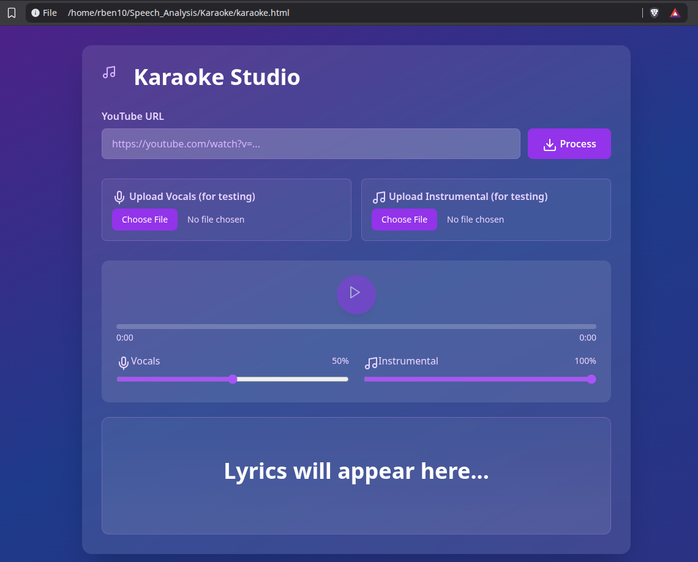

# 🎤 Karaoke Studio

> **Turn any YouTube video into your personal karaoke stage!** Powered by cutting-edge AI source separation.

<div align="center">


**• [Documentation](#) • [Report Bug](#)**

</div>

---

## 🚀 What's This?

Ever wanted to sing along to your favorite songs without the original vocals getting in the way? **Karaoke Studio** uses Facebook's state-of-the-art **Demucs AI** to separate vocals from instrumentals in real-time, giving you studio-quality karaoke from any YouTube link!

### ✨ Features

- 🎵 **AI-Powered Separation** - Demucs Hybrid Transformer splits vocals & instrumentals
- 📺 **YouTube Integration** - Paste any URL, get instant karaoke
- 🎚️ **Dual Volume Control** - Mix vocals & instrumentals to your liking
- 📝 **Synced Lyrics** - Real-time lyrics display (LRC format)
- 🎨 **Beautiful UI** - Modern gradient design with glassmorphism
- ⚡ **Fast Processing** - ~5-10 min per song (GPU recommended)

---

## 🎬 Quick Start

### Prerequisites

```bash
# System requirements
- Python 3.8+
- FFmpeg
- CUDA GPU (optional but recommended)
```

### Installation

```bash
# 1. Clone the repo
git clone https://github.com/rustombhesania/Speech_Analysis_karaoke.git
cd Speech_Analysis_karaoke

# 2. Create virtual environment
python -m venv venv
source venv/bin/activate  # Windows: venv\Scripts\activate

# 3. Install dependencies
pip install flask flask-cors yt-dlp demucs syncedlyrics torch

# 4. Install FFmpeg
# Ubuntu: sudo apt install ffmpeg
# Mac: brew install ffmpeg
# Windows: Download from ffmpeg.org
```

### Run It! 🎸

```bash
# Terminal 1: Start backend
python karaoke_backend.py

# Terminal 2: Open frontend
# Simply open karaoke.html in your browser
# Or use: python -m http.server 8000
```

Visit `http://localhost:8000` and start singing! 🎤

---

## 🎯 How It Works

```
YouTube URL → yt-dlp → Audio Download
                ↓
           Demucs AI → Vocal Separation
                ↓
        syncedlyrics → Fetch Lyrics
                ↓
         React App → Karaoke Magic! ✨
```

**The Tech Stack:**
- **Backend**: Flask + Demucs + yt-dlp
- **Frontend**: React + Tailwind CSS
- **AI Model**: Demucs Hybrid Transformer (htdemucs)
- **Lyrics**: syncedlyrics API

---

## 🎵 Usage

1. **Copy a YouTube URL** (music video, live performance, anything!)
2. **Paste it** into Karaoke Studio
3. **Wait ~5-10 minutes** while Demucs works its magic
4. **Sing along!** Adjust vocals to 0% for pure karaoke mode

### 🎚️ Pro Tips

- Set vocals to **0%** for pure instrumental karaoke
- Set vocals to **50%** to practice along with the artist
- Use the **seek bar** to replay tricky parts
- Upload your own audio files for testing

---

## 🧠 The Science Behind It

This project uses **Demucs v4 (Hybrid Transformer)** - Meta's state-of-the-art music source separation model:

- 🏆 **Winner** of Sony MDX Challenge 2021
- 📊 **9.20 dB SDR** - Best-in-class separation quality
- 🔬 **Hybrid Architecture** - Combines time-domain + frequency-domain processing
- 🤖 **Transformer Power** - Cross-domain attention for context-aware separation

**Research Paper**: [Hybrid Transformers for Music Source Separation](https://github.com/facebookresearch/demucs)

---

## 📸 Screenshots

<div align="center">

<p><i>Beautiful gradient UI with real-time lyrics and dual volume controls</i></p>
</div>

---

## 🛠️ Technical Challenges Solved

| Challenge | Solution |
|-----------|----------|
| Audio Sync Issues | Single source timeupdate for both tracks |
| Dynamic Demucs Paths | Glob pattern matching for outputs |
| CORS Errors | Flask-CORS proper configuration |
| Memory Leaks | Cleanup endpoints + temp directories |
| Format Compatibility | Force MP3 conversion via FFmpeg |

---

## 🚧 Roadmap

- [ ] **v1.1** - Perfect lyrics synchronization
- [ ] **v1.2** - Waveform visualization
- [ ] **v1.3** - Pitch detection & scoring
- [ ] **v2.0** - Multi-user karaoke rooms
- [ ] **v3.0** - Mobile app (iOS/Android)

---

## 🎓 Academic Context

**Course**: Speech Analysis  
**Institution**: Institute for Natural Language Processing (IMS), University of Stuttgart  
**Adviser**: Dr. Wolfgang Wokurek  
**Author**: Rustom Firdosh Bhesania

This project demonstrates practical applications of music source separation techniques in speech analysis and audio processing.

---

## 🤝 Contributing

Contributions are welcome! Feel free to:

1. 🐛 Report bugs
2. 💡 Suggest features
3. 🔧 Submit pull requests

---

## 📜 License

MIT License - feel free to use this for your own karaoke parties! 🎉

---

## 🙏 Acknowledgments

- **Meta AI Research** - For the incredible Demucs model
- **MUSDB18** - Training dataset
- **Dr. Wolfgang Wokurek** - Academic guidance
- **Open Source Community** - For amazing tools (yt-dlp, Flask, React)

---

<div align="center">

### ⭐ Star this repo if you love karaoke!

**Made with ❤️ and 🎵 by [Rustom Bhesania](https://github.com/rustombhesania)**

[⬆ Back to Top](#-karaoke-studio)

</div>
